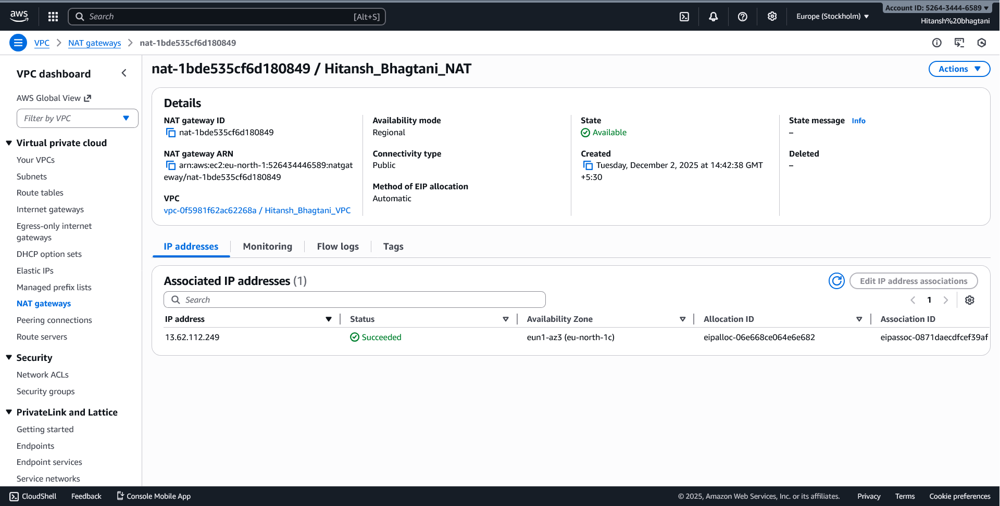

# Task 1 — AWS VPC Setup (Networking & Subnetting)

This task involved creating a custom VPC with 2 public and 2 private subnets, an Internet Gateway, a NAT Gateway, and route tables for proper routing.

## 📌 CIDR Ranges Used
- **VPC:** `10.0.0.0/16`
- **Public Subnet 1:** `10.0.1.0/24`
- **Public Subnet 2:** `10.0.2.0/24`
- **Private Subnet 1:** `10.0.3.0/24`
- **Private Subnet 2:** `10.0.4.0/24`

Ranges are chosen for:
✔ Simplicity  
✔ Easy expansion  
✔ Clear separation between public and private networks  

---

# 📸 Screenshots

### VPC

### Public and Private Subnets

### Route Tables

### Public Route Table

### Private Route Table

### Internet Gateway

### NAT Gateway

---

# 📁 Files Included
- `main.tf` — Terraform code to build the entire VPC
- Screenshot folder with all network components
