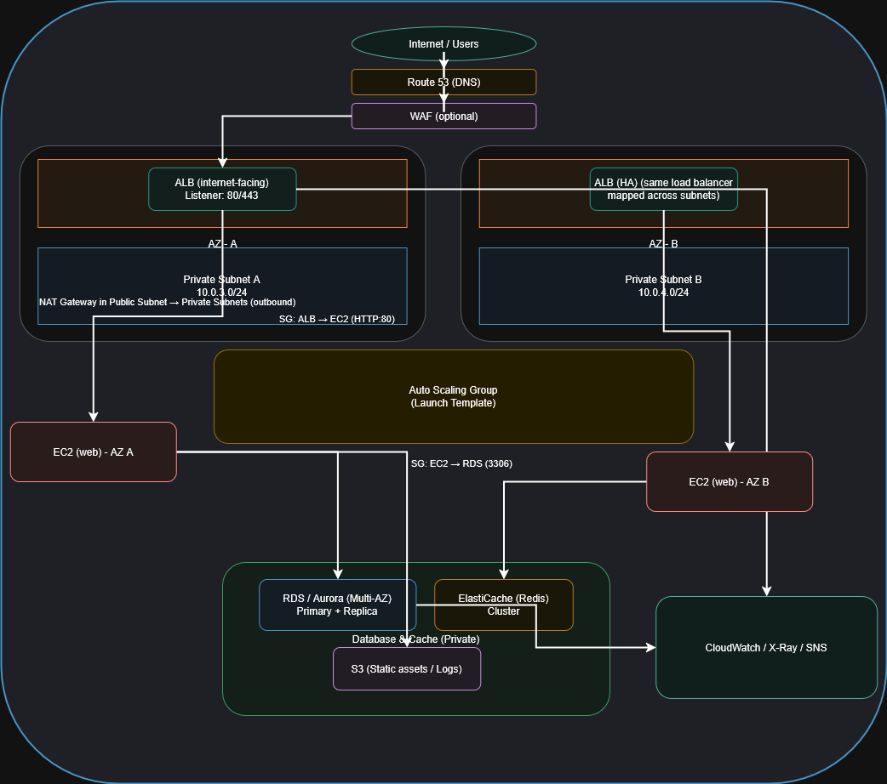

# Task 5 — Scalable AWS Architecture Diagram (10,000 Concurrent Users)

This task involves designing a highly scalable and fault-tolerant AWS architecture capable of handling **10,000+ concurrent users**. The design emphasizes high availability, elasticity, security, and multi-tier isolation following AWS Well-Architected Framework principles.

---

## 📑 Architecture Overview (Explanation)

The architecture uses an **internet-facing Application Load Balancer (ALB)** deployed across two public subnets to distribute traffic to an **Auto Scaling Group (ASG)** of EC2 instances placed in private subnets across multiple Availability Zones.
A **Multi-AZ RDS/Aurora database** provides a durable and fault-tolerant data layer, while **ElastiCache (Redis)** is used for caching to reduce database load and improve application performance.
Outbound traffic from private instances is routed through a **NAT Gateway** in the public subnet.
Security is enforced using **Security Groups, NACLs, IAM roles**, and optionally **AWS WAF** in front of the ALB.
Observability and monitoring are provided through **CloudWatch metrics, logs, alarms**, and **X-Ray** for tracing.
Static content and logs are stored in **Amazon S3**, and SNS is used for alert notifications.

---

## 🛠 Components Used

### **Networking**

* VPC (10.0.0.0/16)
* 2 Public Subnets (multi-AZ)
* 2 Private Subnets (multi-AZ)
* NAT Gateway (public subnet)
* Internet Gateway

### **Compute & Load Balancing**

* Application Load Balancer (public)
* Auto Scaling Group (private)
* Launch Template with application configuration

### **Storage & Data Layer**

* RDS / Aurora (Multi-AZ)
* ElastiCache (Redis cluster)
* Amazon S3 (assets, logs, backups)

### **Security**

* Security Groups
* NACLs
* IAM Roles
* AWS WAF (optional)
* Route 53 (optional DNS)

### **Observability**

* CloudWatch (metrics, logs, alarms)
* X-Ray (Tracing)
* SNS (alerts)

---

## 🚲 Traffic Flow Summary

1. User → Internet → Route53 → (optional WAF) → ALB
2. ALB routes HTTP/HTTPS traffic to Target Group
3. Target Group forwards requests to EC2 instances inside the Auto Scaling Group
4. EC2 instances interact with:

   * **RDS/Aurora** for database queries
   * **ElastiCache (Redis)** for cached reads
   * **S3** for static content
5. Logs and metrics are sent to **CloudWatch**
6. Private instances use **NAT Gateway** for outbound access (updates, package installs)

---

## 💼 Architecture Diagram

### **PNG Version**

```md

```

## 📁 Files Included

```
Task_5_Architecture/
│── architecture(1).drawio        # Source file for draw.io
│── architecture.png           # Exported PNG diagram
└── README.md                  # This documentation
```

---

## 📝 Notes

* Diagram follows best practices for multi-AZ high availability.
* Suitable for scalable web applications, SaaS platforms, and high-traffic systems.
* Designed to align with AWS Well-Architected Framework pillars:

  * **Operational Excellence**
  * **Security**
  * **Reliability**
  * **Performance Efficiency**
  * **Cost Optimization**

---
